# Architect 2.0 — Architecture Diagram

> Visual map of every service, data flow, and integration in the platform.
> Last updated to reflect all built features.

---

## What's Actually Built (Feature Map)

| Feature | Type | Where |
|---|---|---|
| Email + Google OAuth | ✅ Real | Supabase Auth |
| Per-project build mode (vibe/code) | ✅ Real | BuildModeModal → projects.persona |
| Dynamic agent pipeline from prompt | ✅ Real | intentParser.ts → agent_nodes table |
| Agent nodes persisted to DB | ✅ Real | Supabase agent_nodes |
| Node config panel (model, prompt, tools, memory) | ✅ Real | CanvasLens → agent_nodes update |
| Chat with real AI (streaming) | ✅ Real | POST /api/chat → Bedrock SSE |
| Chat history persisted | ✅ Real | Supabase chat_messages |
| Code generation with syntax highlighting | ✅ Real | POST /api/synthesize → Bedrock SSE → prism-react-renderer |
| File plan approval before generation | ✅ Real | buildFileTree() → user approves → stream |
| Model switching with mid-stream warning | ✅ Real | Navbar → Zustand → restartStream() |
| GitHub import with real LLM analysis | ✅ Real | POST /api/analyze-repo → RAG → Claude |
| TF-IDF RAG (80% token reduction) | ✅ Real | analyze_repo.py — pure Python |
| Overview lens — animated pipeline | ✅ Real | OverviewLens.tsx → parseIntent() |
| Overview lens — live execution preview | ✅ Real | OverviewLens.tsx → runPreview() simulation |
| Overview lens — lyzr.config.json preview | ✅ Real | OverviewLens.tsx → Stack tab |
| Deploy modal — Lyzr Studio / Bedrock / Self-host | ✅ UI flow | DeployModal.tsx |
| Delete projects | ✅ Real | Supabase DELETE + confirm overlay |
| Settings — real profile load/save | ✅ Real | Supabase profiles table |
| Settings — GitHub connect/disconnect | ✅ UI flow | SettingsPage.tsx |
| Prompt validation before synthesize | ✅ Real | DashboardPage.tsx |
| CORS for production deploy | ✅ Real | FRONTEND_URL env var |

---

## Full System Architecture

```mermaid
graph TB
    subgraph Browser["🌐 Browser (React 18 + Vite + TypeScript)"]
        UI["UI Layer\nTailwind CSS + Zustand"]
        Auth["Auth Module\nSupabase JS Client"]
        SSE["SSE Client\nuseStreamingCode hook"]
        Canvas["CanvasLens\nIntent parser + Node config panel"]
        Overview["OverviewLens\nPipeline + Files + Stack + Preview"]
        CodeL["CodeLens\nFile plan approval + prism-react-renderer"]
        Chat["Chat Module\nReal streaming AI responses"]
        Modals["Modals\nBuildMode · Deploy · ImportGitHub"]
    end

    subgraph Vercel["▲ Vercel (CDN + Edge)"]
        Static["Static Assets\nReact SPA"]
    end

    subgraph FastAPI["🚀 FastAPI Backend (Railway)"]
        Synth["/api/synthesize\nSSE code generation"]
        ChatAPI["/api/chat\nSSE chat stream"]
        AnalyzeAPI["/api/analyze-repo\nRAG + LLM analysis"]
        Projects["/api/projects\nCRUD proxy"]
        Health["/health\nStatus check"]
    end

    subgraph RAG["🔍 RAG Pipeline (Pure Python, zero deps)"]
        Chunker["File Chunker\n400-char chunks"]
        TFIDF["TF-IDF Vectoriser\nIDF = log((N+1)/(df+1))"]
        Cosine["Cosine Similarity\nTop-8 chunks · ~87% token reduction"]
    end

    subgraph IntentParser["🧠 Intent Parser (Frontend)"]
        Parser["parseIntent(prompt)\nDetects tools · Selects agent types"]
        FileTree["buildFileTree(prompt, framework)\nPrompt-aware file structure"]
        NodePersist["nodesToSupabaseRows()\nFirst-visit only · cached in DB"]
    end

    subgraph ModelLayer["⚙️ Model-Agnostic Layer"]
        Guard["Mid-stream warning\nisStreaming check"]
        Registry["BEDROCK_MODELS set\nvalidation + fallback"]
        LLMFactory["get_llm(model_id)\nChatBedrockConverse"]
    end

    subgraph Bedrock["🟠 Amazon Bedrock (us-east-1)"]
        Haiku["Claude Haiku 4.5\nDefault · Fastest"]
        Sonnet["Claude Sonnet 4\nBalanced"]
        Sonnet45["Claude Sonnet 4.5\nBest reasoning"]
    end

    subgraph Supabase["🟢 Supabase"]
        SupaAuth["Auth\nEmail + Google OAuth"]
        Postgres["Postgres + RLS"]
        subgraph Tables["Tables"]
            Profiles["profiles\nname · email · persona"]
            Projects2["projects\nframework · prompt · persona"]
            AgentNodes["agent_nodes\nmodel · system_prompt · tools · memory"]
            ChatMsgs["chat_messages\nrole · content · project_id"]
        end
    end

    subgraph GitHub["🐙 GitHub Public API (no auth)"]
        TreeAPI["GET /git/trees/HEAD?recursive=1"]
        RawAPI["raw.githubusercontent.com"]
    end

    subgraph LyzrStudio["🟣 Lyzr Agent Studio"]
        AgentRuntime["Agent Runtime\nlyzr.config.json"]
        ExecLogs["Execution Logs\nTool traces + Memory"]
        BedrockAgents["Amazon Bedrock Agents\nEnterprise option"]
        SelfHost["Self-host\nRailway / Docker"]
    end

    subgraph Sandbox["📦 Sandbox (Future: ECS Fargate)"]
        Container["Isolated Pod\n1 vCPU · 2GB · 15min TTL"]
        SQS["SQS Queue\nJob dispatch"]
    end

    %% User flows
    Browser -->|"HTTPS"| Vercel
    Vercel -->|"serves"| Static
    Browser -->|"Supabase JS"| SupaAuth
    Browser -->|"Supabase JS"| Postgres

    %% Auth
    SupaAuth -->|"JWT"| Browser
    SupaAuth -->|"Google OAuth callback"| Browser

    %% Intent parsing (frontend, no backend)
    Canvas --> Parser
    Parser --> NodePersist
    NodePersist -->|"INSERT agent_nodes\n(first visit only)"| AgentNodes
    Parser -->|"load from DB\n(revisit)"| AgentNodes
    CodeL --> FileTree

    %% Node config panel
    Canvas -->|"UPDATE agent_nodes\nmodel · prompt · tools · memory"| AgentNodes

    %% API calls
    SSE -->|"POST /api/synthesize\n{prompt, framework, model_id}"| Synth
    Chat -->|"POST /api/chat\n{message, history, model_id}"| ChatAPI
    Browser -->|"POST /api/analyze-repo\n{repo_url}"| AnalyzeAPI

    %% RAG pipeline
    AnalyzeAPI -->|"fetch tree + key files"| GitHub
    GitHub --> TreeAPI & RawAPI
    AnalyzeAPI --> Chunker --> TFIDF --> Cosine
    Cosine -->|"top-8 chunks"| AnalyzeAPI

    %% Model layer
    Synth --> Guard --> Registry --> LLMFactory
    ChatAPI --> LLMFactory
    AnalyzeAPI --> LLMFactory
    LLMFactory --> Haiku
    LLMFactory -.-> Sonnet
    LLMFactory -.-> Sonnet45

    %% SSE streams back
    Synth -->|"SSE data: <line>"| SSE
    ChatAPI -->|"SSE data: <chunk>"| Chat

    %% DB writes
    Browser -->|"chat_messages"| ChatMsgs
    Browser -->|"projects + persona"| Projects2
    Browser -->|"profiles"| Profiles

    %% Deploy targets
    Modals -->|"Deploy to Lyzr Studio"| AgentRuntime
    Modals -->|"Deploy to Bedrock"| BedrockAgents
    Modals -->|"Self-host"| SelfHost
    AgentRuntime --> ExecLogs

    %% Future
    Synth -.->|"future"| SQS --> Container
```

---

## Request Flow: User Types a Prompt

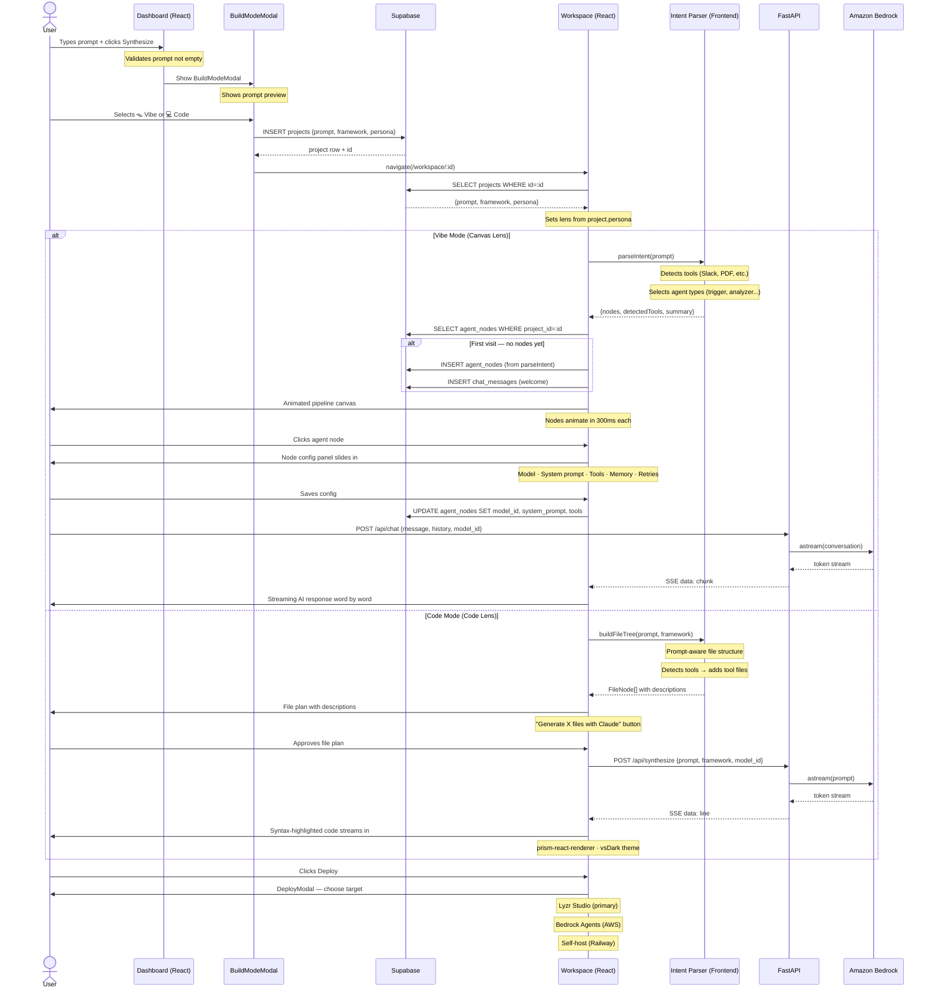

---

## GitHub Import Flow (RAG-Powered)

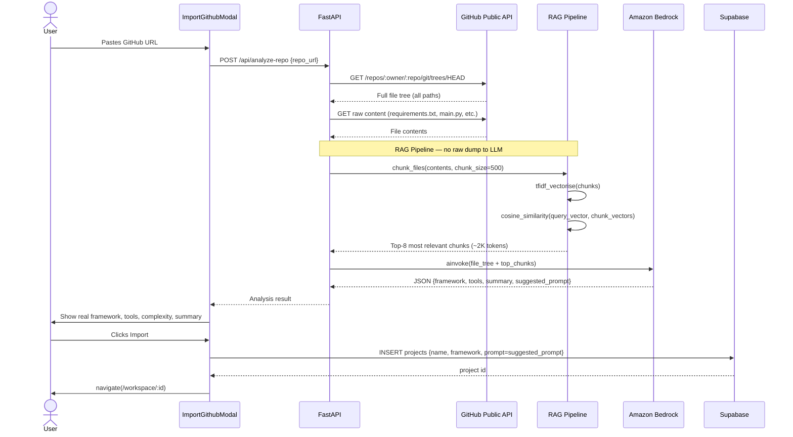

---

## Model-Agnostic Layer

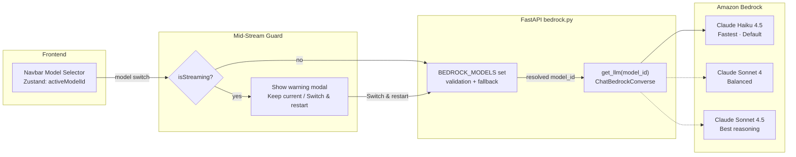

---

## Deployment Architecture

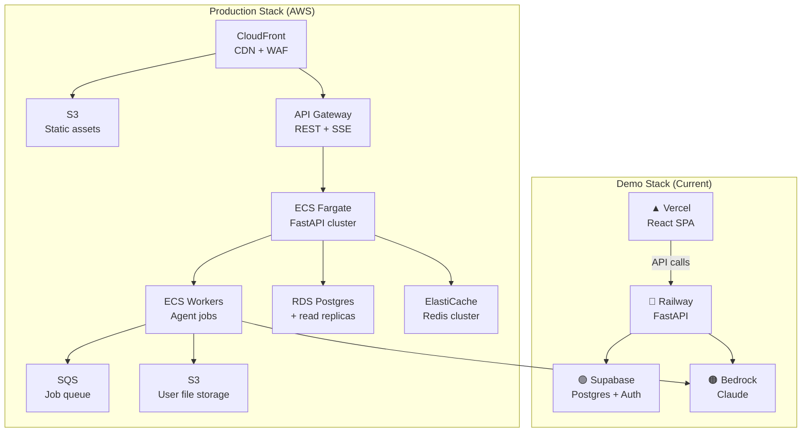

---

## Services Summary

| Service | Role | Why chosen |
|---|---|---|
| React 18 + Vite | Frontend SPA | Fast HMR, TypeScript, component ecosystem |
| Zustand | Global state | No boilerplate, persists across routes, model switch guard |
| React Router v6 | Routing | Real URLs, auth guard in AppShell |
| FastAPI | Backend API | Python = same as agents, native async, SSE |
| Amazon Bedrock | LLM inference | Claude models, AWS-native, no key rotation needed |
| ChatBedrockConverse | Bedrock client | Correct API for new inference profile IDs (us.*) |
| Supabase Auth | Authentication | Google OAuth + email in minutes, JWT, free tier |
| Supabase Postgres | Database | RLS on all tables, JSONB for tools array |
| LangGraph | Agent orchestration | Stateful graph, handles retry loops |
| SSE (Server-Sent Events) | Streaming | Simpler than WebSockets for one-directional streams |
| prism-react-renderer | Syntax highlighting | VS Code dark theme, Python tokens, streaming-safe |
| TF-IDF RAG | Repo analysis | Zero extra deps, 87% token reduction vs raw dump |
| intentParser.ts | Frontend intent parsing | No LLM call needed — saves tokens on every workspace load |
| buildFileTree() | File structure | Prompt-aware, framework-specific, tool-aware file names |
| Lyzr Studio | Primary deploy target | Full agent observability, tool traces, memory state |
| Amazon Bedrock Agents | Secondary deploy | Enterprise AWS-native option |
| ECS Fargate (prod) | Sandbox | Per-user isolation, AWS-native, K8s-ready |
| Vercel | Frontend deploy | Push-to-deploy, global CDN, env vars UI |
| Railway | Backend deploy | Procfile auto-detect, FRONTEND_URL CORS env var |
| createPortal | Modal rendering | Escapes overflow-y-auto stacking context |

---

## Frontend Component Architecture

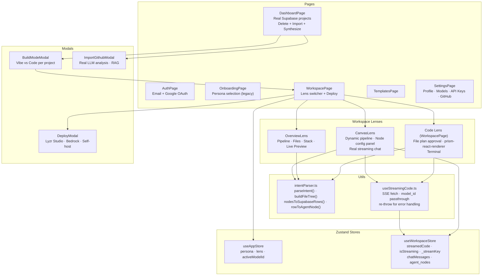

---

## Token Cost Optimisation Strategy

| Technique | Where | Saving |
|---|---|---|
| Intent parsing on frontend | intentParser.ts | 100% — no LLM call for canvas nodes |
| Agent nodes cached in DB | agent_nodes table | 100% on revisit — no re-parse |
| Chat history capped at last 6 messages | /api/chat | ~60% context window reduction |
| TF-IDF RAG for repo analysis | analyze_repo.py | ~87% — top-8 chunks vs full dump |
| File content capped at 6K chars | analyze_repo.py | Prevents runaway large files |
| Claude Haiku as default | bedrock.py | 10× cheaper than Sonnet per token |
| File plan shown before generation | CodeLens | User can cancel before any tokens used |
| streamedCode persisted in store | useWorkspaceStore | No re-generation on lens switch |

---

## Observability & Monitoring Architecture

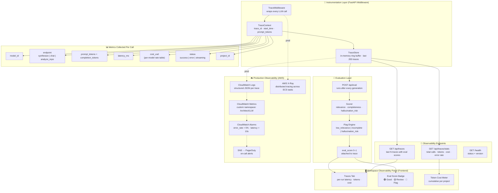

---

## Evaluation Layer — How Agent Output is Scored

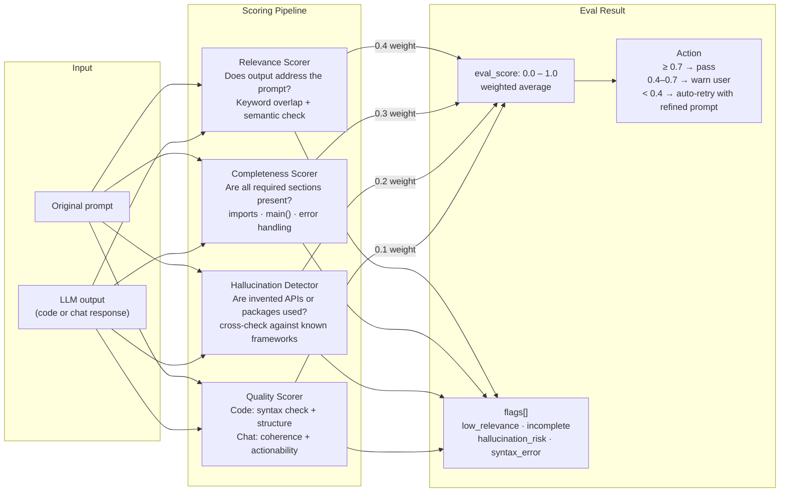

---

## Eval Scoring Criteria

| Dimension | Weight | What is checked | Fail threshold |
|---|---|---|---|
| Relevance | 40% | Output addresses the user's prompt | < 0.5 |
| Completeness | 30% | All required code sections present (imports, main, error handling) | < 0.6 |
| Hallucination Risk | 20% | No invented package names or non-existent APIs | any flag |
| Quality | 10% | Syntax valid, coherent structure, actionable for chat | < 0.4 |

**Auto-retry logic:** if `eval_score < 0.4`, the backend appends a correction prompt and re-invokes the LLM (max 2 retries). The user sees the best-scoring output.

---

## Monitoring Metrics — What We Track

| Metric | Source | Alert threshold |
|---|---|---|
| `llm.latency_p99` | TraceMiddleware | > 15s |
| `llm.error_rate` | TraceStore | > 5% over 5 min |
| `llm.cost_per_hour` | TraceStore | > $5/hr |
| `llm.eval_score_avg` | EvalLayer | < 0.6 over 10 calls |
| `api.error_rate` | FastAPI middleware | > 2% |
| `db.query_latency` | Supabase logs | > 500ms |
| `rag.retrieval_tokens` | analyze_repo | > 3K tokens (cost spike) |
| `stream.dropped_connections` | SSE handler | > 10/min |

---

## Observability Data Flow (Production)

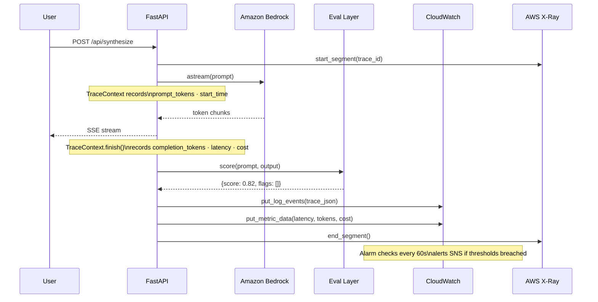

---

## GitHub Import — Deep Dive: From URL to Working Codebase

This section walks through exactly what happens when a user imports a GitHub repo into Architect 2.0 — from the raw URL all the way to a fully analysed, queryable codebase with database persistence.

```mermaid
graph TB
    subgraph Step1["Step 1 — URL Parsing & Tree Fetch"]
        URL["User pastes GitHub URL\nhttps://github.com/owner/repo"]
        Parse["parse_owner_repo(url)\nextracts owner + repo name"]
        TreeFetch["GET /repos/:owner/:repo/git/trees/HEAD?recursive=1\nGitHub Public API — no auth needed"]
        TreeResult["Full file tree\n{path, type, sha, size} per file"]
    end

    subgraph Step2["Step 2 — Selective File Fetch"]
        Filter["Filter by KEY_FILES list\nrequirements.txt · main.py · agents.py\ngraph.py · crew.py · README.md · Dockerfile"]
        RawFetch["GET raw.githubusercontent.com/:owner/:repo/HEAD/:path\nFetch up to 8 key files · cap 6K chars each"]
        Contents["File contents dict\n{filename: content}"]
    end

    subgraph Step3["Step 3 — RAG Pipeline (Token Optimisation)"]
        Chunk["chunk_text(content, chunk_size=400)\nSplit each file into 400-char overlapping chunks\npreserve line boundaries"]
        TFIDF["tfidf_vectorise(chunks)\nBuild term-frequency matrix\nIDF = log((N+1)/(df+1))"]
        Query["ANALYSIS_QUERY\n'agent framework langgraph crewai tools\nslack discord email pdf search database'"]
        Cosine["cosine_similarity(query_vec, chunk_vecs)\nScore every chunk against the query"]
        TopK["retrieve top-8 chunks\n~2K tokens vs ~15K raw dump\n87% token reduction"]
    end

    subgraph Step4["Step 4 — LLM Primary Investigation"]
        Prompt["Structured prompt to Claude\n- File tree (first 50 paths)\n- Top-8 RAG chunks\n- JSON schema to fill"]
        LLM["Claude Haiku 4.5\nvia Amazon Bedrock\nainvoke() — single call"]
        JSONOut["Structured JSON response\n{\n  framework: langgraph|crewai|...\n  language: Python|TypeScript\n  is_agent_project: bool\n  detected_tools: [Slack, PDF, ...]\n  summary: string\n  suggested_prompt: string\n  complexity: simple|moderate|complex\n}"]
    end

    subgraph Step5["Step 5 — Database Persistence"]
        CreateProject["INSERT INTO projects\n{name, framework, prompt=suggested_prompt\npersona=code, status=active}"]
        CreateNodes["parseIntent(suggested_prompt)\n→ agent nodes derived from LLM analysis"]
        InsertNodes["INSERT INTO agent_nodes\n{name, type, system_prompt, tools}"]
        ChatSeed["INSERT INTO chat_messages\nAI welcome message with analysis summary"]
    end

    subgraph Step6["Step 6 — Workspace Initialisation"]
        Navigate["navigate(/workspace/:id)"]
        LoadProject["Workspace loads project from Supabase\nframework · prompt · persona=code"]
        LoadNodes["CanvasLens loads agent_nodes from DB\nno re-parsing — uses saved nodes"]
        FileTree["buildFileTree(suggested_prompt, framework)\nGenerates file structure from LLM's suggested_prompt"]
        CodeLens["Code Lens shows file plan\nUser approves → Generate with Claude"]
    end

    URL --> Parse --> TreeFetch --> TreeResult
    TreeResult --> Filter --> RawFetch --> Contents
    Contents --> Chunk --> TFIDF
    Query --> Cosine
    TFIDF --> Cosine --> TopK
    TopK --> Prompt --> LLM --> JSONOut
    JSONOut --> CreateProject --> CreateNodes --> InsertNodes --> ChatSeed
    ChatSeed --> Navigate --> LoadProject
    LoadProject --> LoadNodes
    LoadProject --> FileTree
    LoadNodes --> CodeLens
    FileTree --> CodeLens
```

---

## GitHub Import — LLM Investigation Detail

What Claude actually does when it receives the RAG context:

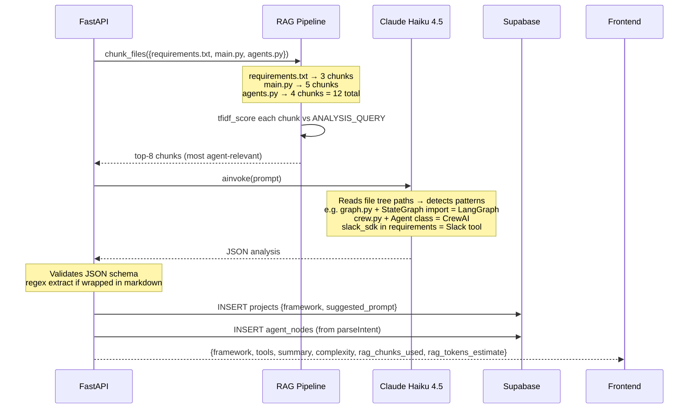

### What the LLM detects from code

| Signal | How detected | Output field |
|---|---|---|
| Framework | `from langgraph`, `StateGraph`, `Crew()`, `Agent()` imports | `framework` |
| Tools/integrations | `slack_sdk`, `pymupdf`, `google-api-python-client` in requirements | `detected_tools` |
| Agent patterns | Class names, function signatures, decorator patterns | `is_agent_project` |
| Complexity | File count + import depth + number of agents | `complexity` |
| Purpose | README + main() docstring + variable names | `summary` |
| Suggested prompt | Synthesised from summary + detected tools | `suggested_prompt` |

---

## Codebase Interaction After Import

Once imported, the user can interact with the codebase in three ways:

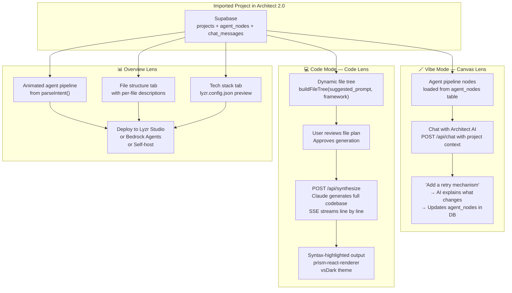

---

## Future Scope — Kubernetes Deployment

How Architect 2.0 scales to thousands of concurrent users on Kubernetes, with per-user isolated agent sandboxes deployed from YAML.

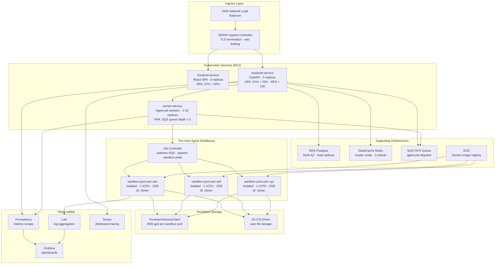

---

## Kubernetes — Agent Sandbox Pod YAML

Every user's agent run gets its own isolated Kubernetes pod, spawned dynamically from this template:

```yaml
# sandbox-pod-template.yaml
apiVersion: v1
kind: Pod
metadata:
  name: sandbox-{{ user_id }}-{{ job_id }}
  namespace: architect-sandboxes
  labels:
    app: agent-sandbox
    user_id: "{{ user_id }}"
    job_id: "{{ job_id }}"
  annotations:
    architect.io/created-at: "{{ timestamp }}"
    architect.io/framework: "{{ framework }}"
spec:
  restartPolicy: Never
  activeDeadlineSeconds: 900        # 15 min hard timeout

  # Security: no privilege escalation, read-only root fs
  securityContext:
    runAsNonRoot: true
    runAsUser: 1000
    fsGroup: 2000

  containers:
    - name: agent-runner
      image: 123456789.dkr.ecr.us-east-1.amazonaws.com/architect-sandbox:latest
      imagePullPolicy: Always

      resources:
        requests:
          cpu: "500m"
          memory: "1Gi"
        limits:
          cpu: "1000m"
          memory: "2Gi"

      env:
        - name: JOB_ID
          value: "{{ job_id }}"
        - name: USER_ID
          value: "{{ user_id }}"
        - name: PROJECT_ID
          value: "{{ project_id }}"
        - name: FRAMEWORK
          value: "{{ framework }}"
        - name: BEDROCK_MODEL_ID
          valueFrom:
            secretKeyRef:
              name: architect-secrets
              key: bedrock-model-id
        - name: AWS_REGION
          value: us-east-1
        - name: SUPABASE_URL
          valueFrom:
            secretKeyRef:
              name: architect-secrets
              key: supabase-url
        - name: OUTPUT_BUCKET
          value: "architect-outputs-{{ user_id }}"

      volumeMounts:
        - name: workspace
          mountPath: /workspace
        - name: tmp
          mountPath: /tmp

      # Liveness: pod must stream output within 60s
      livenessProbe:
        exec:
          command: ["test", "-f", "/workspace/.started"]
        initialDelaySeconds: 10
        periodSeconds: 15

  volumes:
    - name: workspace
      emptyDir:
        sizeLimit: 500Mi
    - name: tmp
      emptyDir:
        sizeLimit: 100Mi

  # Network isolation: no access to other pods
  dnsPolicy: ClusterFirst
  automountServiceAccountToken: false
```

---

## Kubernetes — Full Platform Deployment YAML

```yaml
# architect-deployment.yaml
---
# Backend Deployment
apiVersion: apps/v1
kind: Deployment
metadata:
  name: architect-backend
  namespace: architect
spec:
  replicas: 3
  selector:
    matchLabels:
      app: architect-backend
  template:
    metadata:
      labels:
        app: architect-backend
    spec:
      containers:
        - name: fastapi
          image: 123456789.dkr.ecr.us-east-1.amazonaws.com/architect-backend:latest
          ports:
            - containerPort: 8000
          resources:
            requests: { cpu: "250m", memory: "512Mi" }
            limits:   { cpu: "1000m", memory: "1Gi" }
          env:
            - name: BEDROCK_MODEL_ID
              valueFrom:
                secretKeyRef:
                  name: architect-secrets
                  key: bedrock-model-id
            - name: SUPABASE_URL
              valueFrom:
                secretKeyRef:
                  name: architect-secrets
                  key: supabase-url
          readinessProbe:
            httpGet: { path: /health, port: 8000 }
            initialDelaySeconds: 5
            periodSeconds: 10
          livenessProbe:
            httpGet: { path: /health, port: 8000 }
            initialDelaySeconds: 15
            periodSeconds: 20
---
# Horizontal Pod Autoscaler — Backend
apiVersion: autoscaling/v2
kind: HorizontalPodAutoscaler
metadata:
  name: architect-backend-hpa
  namespace: architect
spec:
  scaleTargetRef:
    apiVersion: apps/v1
    kind: Deployment
    name: architect-backend
  minReplicas: 3
  maxReplicas: 20
  metrics:
    - type: Resource
      resource:
        name: cpu
        target:
          type: Utilization
          averageUtilization: 70
    - type: External
      external:
        metric:
          name: sqs_queue_depth
          selector:
            matchLabels:
              queue: architect-jobs
        target:
          type: AverageValue
          averageValue: "10"
---
# Worker Deployment — Agent Job Processors
apiVersion: apps/v1
kind: Deployment
metadata:
  name: architect-workers
  namespace: architect
spec:
  replicas: 2
  selector:
    matchLabels:
      app: architect-workers
  template:
    metadata:
      labels:
        app: architect-workers
    spec:
      serviceAccountName: sandbox-spawner   # RBAC to create sandbox pods
      containers:
        - name: worker
          image: 123456789.dkr.ecr.us-east-1.amazonaws.com/architect-worker:latest
          resources:
            requests: { cpu: "500m", memory: "512Mi" }
            limits:   { cpu: "2000m", memory: "2Gi" }
---
# HPA — Workers scale on SQS queue depth
apiVersion: autoscaling/v2
kind: HorizontalPodAutoscaler
metadata:
  name: architect-workers-hpa
  namespace: architect
spec:
  scaleTargetRef:
    apiVersion: apps/v1
    kind: Deployment
    name: architect-workers
  minReplicas: 2
  maxReplicas: 50
  metrics:
    - type: External
      external:
        metric:
          name: sqs_queue_depth
        target:
          type: AverageValue
          averageValue: "5"
---
# Network Policy — Sandbox pods cannot talk to each other
apiVersion: networking.k8s.io/v1
kind: NetworkPolicy
metadata:
  name: sandbox-isolation
  namespace: architect-sandboxes
spec:
  podSelector:
    matchLabels:
      app: agent-sandbox
  policyTypes:
    - Ingress
    - Egress
  ingress:
    - from:
        - namespaceSelector:
            matchLabels:
              name: architect          # only backend can reach sandbox
  egress:
    - to:
        - ipBlock:
            cidr: 0.0.0.0/0
            except:
              - 10.0.0.0/8             # block internal cluster IPs
              - 172.16.0.0/12
              - 192.168.0.0/16
```

---

## Kubernetes Scaling Strategy

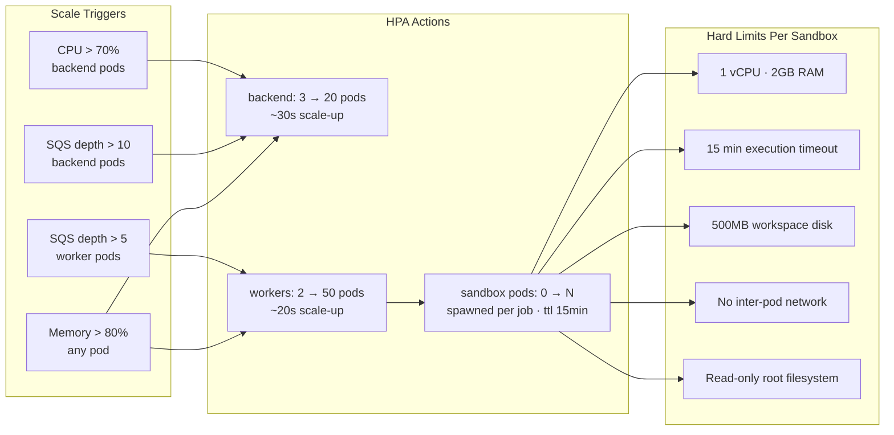

| Scenario | Pods spawned | Est. cost/hr |
|---|---|---|
| 10 concurrent users | 3 backend + 2 workers + 10 sandboxes | ~$0.80 |
| 100 concurrent users | 8 backend + 10 workers + 100 sandboxes | ~$6.50 |
| 1000 concurrent users | 20 backend + 50 workers + 1000 sandboxes | ~$65 |
| Idle (0 users) | 3 backend + 2 workers + 0 sandboxes | ~$0.15 |


---

## Agent Harness — How the Agent Plans, Executes, and Recovers

The agent harness is the core engine that turns a user's prompt into a running agentic application. It is a **LangGraph StateGraph** — a directed graph where each node is an agent function, edges define execution order, and conditional edges handle retries and routing.

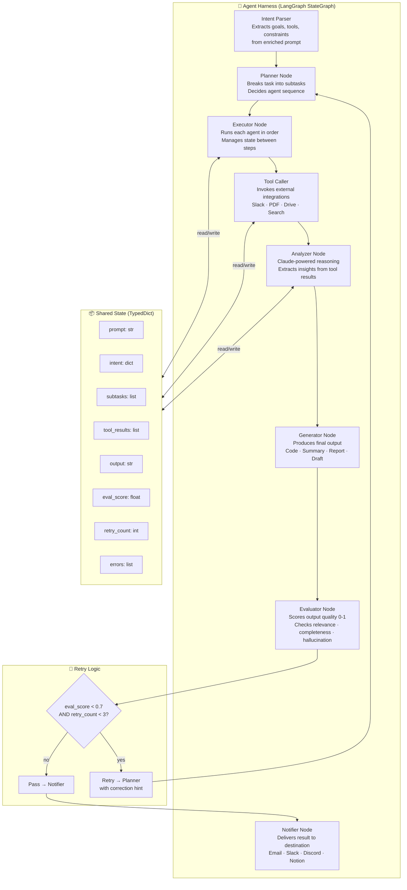

---

## Agent Harness — Non-Technical User (Vibe Mode)

What the harness looks like from a non-technical user's perspective — they never see the graph, they see a conversation and a visual pipeline.

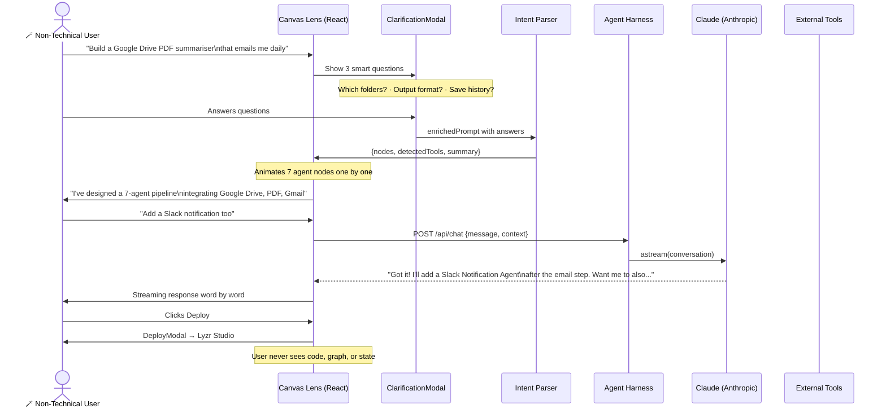

### What the Non-Technical User Sees vs What's Happening

| What user sees | What's actually happening |
|---|---|
| "Analysing your prompt..." animation | `parseIntent()` running keyword detection |
| Agent nodes animating in one by one | `nodesToSupabaseRows()` saving to DB |
| "7-agent pipeline integrating Google Drive, PDF, Gmail" | Intent parser detected tools from prompt keywords |
| Clicking an agent node | Opens config panel — reads/writes `agent_nodes` table |
| "Add a Slack notification" in chat | `POST /api/chat` → Claude → SSE stream back |
| "Your agent is live on Lyzr Studio" | `lyzr.config.json` generated from `agent_nodes` rows |
| Live Preview tab → Run Agent | Simulated execution logs from `runPreview()` |

---

## Agent Harness — Technical User (Code Mode)

What the harness exposes to a developer — full visibility into every layer.

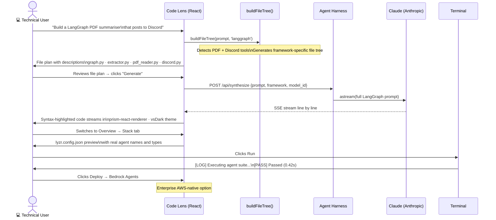

### What the Technical User Sees vs What's Happening

| What developer sees | What's actually happening |
|---|---|
| File plan with per-file descriptions | `buildFileTree(prompt, framework)` — prompt-aware, tool-aware |
| "Generate 11 files with Claude" button | User approves before any tokens are spent |
| Syntax-highlighted code streaming in | `useStreamingCode` → SSE → `prism-react-renderer` |
| File explorer with framework badge | Dynamic tree from `buildFileTree()` — different per framework |
| lyzr.config.json in Stack tab | Generated from real `agent_nodes` rows in Supabase |
| Model selector in Navbar | Passes `model_id` to backend — `get_llm()` resolves provider |
| Mid-stream model switch warning | `isStreaming` guard → "Switch & restart" or "Keep current" |
| Node config panel | Reads/writes `agent_nodes.model_id`, `system_prompt`, `tools` |

---

## Agent Harness — State Schema

The TypedDict state that flows through every node in the LangGraph graph:

```python
from typing import TypedDict, List, Optional

class ArchitectState(TypedDict):
    # Input
    prompt: str                    # original user prompt
    enriched_prompt: str           # prompt + clarification answers
    framework: str                 # langgraph | crewai | pydanticai | autogen
    model_id: str                  # which Claude model to use

    # Planning
    intent: dict                   # {tools, agent_types, output_format, schedule}
    subtasks: List[dict]           # [{agent, task, tools_needed}]

    # Execution
    tool_results: List[dict]       # [{tool, input, output, latency_ms}]
    intermediate_outputs: List[str]

    # Output
    output: str                    # final generated content
    generated_files: List[dict]    # [{path, content, language}]

    # Quality
    eval_score: float              # 0.0 - 1.0
    eval_flags: List[str]          # hallucination_risk | incomplete | low_relevance
    retry_count: int               # max 3

    # Meta
    errors: List[str]
    trace_id: str                  # for observability
    project_id: str                # links back to Supabase
```

---

## Agent Harness — Tool Execution Pattern

How tools are called inside the harness and results fed back into state:

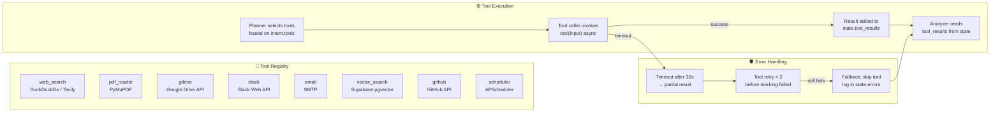

---

## Agent Harness — Error Recovery

What happens when something goes wrong at each layer:

| Failure point | Detection | Recovery |
|---|---|---|
| Tool call timeout | 30s timeout per tool | Retry ×2 → skip tool → log error in state |
| LLM returns empty | Empty content check | Re-invoke with "please try again" prefix |
| Eval score < 0.4 | Evaluator node | Append correction hint → retry planner (max 3×) |
| Eval score 0.4–0.7 | Evaluator node | Warn user in chat → ask if they want to retry |
| Eval score ≥ 0.7 | Evaluator node | Pass to notifier → deliver output |
| Backend unreachable | Frontend fetch catch | Show error state + Retry button + server command |
| Model switch mid-stream | `isStreaming` guard | Warning modal → user chooses keep/restart |
| DB write fails | Supabase error | Log to console → continue (non-blocking) |
| GitHub API rate limit | 403 response | Return partial tree + note in analysis |

---

## Agent Harness — Vibe vs Code User Comparison

| Dimension | 🪄 Vibe (Non-Technical) | 💻 Code (Technical) |
|---|---|---|
| **Entry point** | Plain English prompt | Plain English prompt |
| **Clarification** | 3 smart questions (LLM-generated) | 3 smart questions (same) |
| **Pipeline view** | Animated agent nodes in plain English | File tree with per-file descriptions |
| **Approval step** | None — pipeline builds automatically | "Generate X files" button — explicit approval |
| **AI interaction** | Chat window — conversational | Chat + code streaming side by side |
| **Model control** | Global model selector in Navbar | Global + per-agent model in node config panel |
| **Code visibility** | Hidden — "Curious about the code?" link | Full IDE with syntax highlighting |
| **Tool config** | Click node → tools checkboxes | Visible in generated tools.py file |
| **Deploy target** | Lyzr Studio (primary) | All 3: Lyzr Studio · Bedrock · Self-host |
| **Harness visibility** | Never sees the graph | Can inspect every node in Overview lens |
| **Token usage** | ~0 for pipeline (keyword parsing) | ~2K tokens for code generation |
| **Lyzr config** | Auto-generated on deploy | Visible in Stack tab before deploy |
